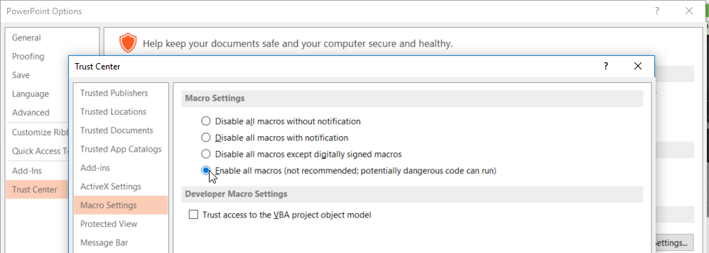
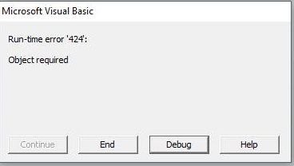
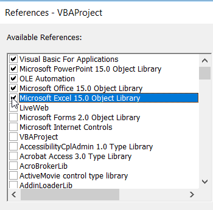

```{r global_options, include=FALSE}
knitr::opts_chunk$set(fig.pos = 'H')
knitr::opts_chunk$set(fig.align="center")
#fmt<-tryCatch({fmt}, error=function(error_message) {return("html_document")  })
is_html<-knitr::is_html_output()
is_pdf<-!is_html
#fmt <- rmarkdown::default_output_format(knitr::current_input())$name
print(is_html)
knitr::opts_chunk$set(fig.align="center")
#if(fmt=="html_document"){is_pdf<-FALSE;is_html<-TRUE}else{is_pdf<-TRUE;is_html<-FALSE}
```


This tools enables users to export images to PPT slides automatically. Images might be stored locally, or the path to their location might be listed in a table. It supports custom PPT layouts. The source code of the project is [here](https://github.com/quarktetra/JMP_Discovery_2020_git_demo/blob/master/IMAGETABLE_TO_PPT.jsl).
*Acknowledgments:* Heidi Hardner.

# Instructions to get started
In order to enable the macro, you will need to follow the steps below:

1. You need a file with proper image paths. Find a sample data set here:  [example table with images.jmp](https://github.com/quarktetra/JMP_Discovery_2020_git_demo/raw/master/MET_OBJECTS_WITH_PATHS_simplified.jmp), and open the file.
1. Run the JSL script. It will prompt the following UI:


```{r jmpui,echo=FALSE, echo=FALSE, out.width='100%',eval=is_html,fig.cap="JMP UI"}
knitr::include_graphics('jmp_ui.png')
```
## Column Selection

* **Image Path(s):**  [Required] Select the columns with the image paths. If there are multiple columns, the script will stack them.
* **Image Labels(s):** [Optional] There will be a table on top of each image. Select at most 3 columns to appear in the table
* **Slide Label(s):**  [Optional] Serves two purposes: i) Creates a slide title ii) Creates a new slide when title changes.

## Export options

* **Selected Rows only**: If there are selected rows in your data, the script assumes you just want these rows in PPT. You can disable that by unchecking the box.
*  **PPT Layout**:
    * **grid**:  Creates a grid of images where number of columns and rows are selected by the dropboxes. Image sizes are computed automatically.
    * **custom**: If user has a custom layout, it can be selected here. More on this in the   [Customizing the tool section](#customizing).

    


# Customizing the tool <a id="customizing"></a>
The tool is 100% data agnostic and highly customizable. Once installed, the Add-in will create a directory **C:\\IMAGETABLE_TO_PPT**.  Locate that folder and find the following
1. **export_images_options.jmp**: This file is all yours to change. UI will load the options from this file.

                
```{r echo=FALSE,warning=FALSE}
dt <- read.csv("./export_images_options.csv", encoding = "UTF-8",check.names=FALSE)
library(knitr)
library(kableExtra)
if(is_html){kable(dt,caption = "JMP options") %>%
    kable_styling("striped", full_width = T,fixed_thead = T)%>%
    scroll_box( height = "450px")}else{kable(dt,caption = "JMP  options")}
```

* *Images Per Row*: Sets the dropdown contents. Order is preserved, i.e., first item will be the selected one. Try to keep this smaller that 4 or so.
* *Number of Rows*: Sets the dropdown contents. Order is preserved. allowed values are : 1 and 2.
* *Possible Image Label Columns*: Best guesses for image label column. If they are found in the table, boxes will be populated automatically.
* *Possible Path Columns*: Best guesses for image path columns. If they are found in the table, boxes will be populated automatically.
* *Possible Slide Label Columns*: Best guesses for slide label columns. If they are found in the table, boxes will be populated automatically.
* *ppt layout*: 
  - "grid" is defined by the  Images Per Row and Number of Rows selections. 
  - You can add your custom layout into the list such as __one_big_three_small.jsl__. This script needs to be saved under  the folder **"\\ppt layout scripts"**. You can create your own template script or ask the developer to build one for you.
  


# What could go wrong with PPT
You will probably need to make few changes in the PPT settings:

## Enable VBA macros: 
File >>Options>>Trust Center>>Trust Center Settings>>Macro Settings>>Enable all macros

```{r enablemacros,echo=FALSE, echo=FALSE, out.width='70%',eval=is_html,fig.cap="Enabling PPT Macros"}

```

## Missing Library Error: 
You may encounter this error related to missing libraries: 


```{r missinglibe,echo=FALSE, echo=FALSE, out.width='70%',eval=is_html,fig.cap="Missing library error"}
knitr::include_graphics('missing_lib_err.png')
```

Close the error window, and the VBA window (if open). In PPT View>>Macros, select the macro, and hit Edit to launch the VBA editor.


```{r missinglibefix,echo=FALSE, echo=FALSE, out.width='70%',eval=is_html,fig.cap="Missing library error fix, step 1"}
knitr::include_graphics('missing_lib_fix1.png')
```

In the  VBA editor Tools >> References

```{r missinglibefix2,echo=FALSE, echo=FALSE, out.width='70%',eval=is_html,fig.cap="Missing library error fix, step 2"}
knitr::include_graphics('missing_lib_fix2.png')
```

Look for a checked "MISSING: Microsoft Excel XX Object Library", and uncheck it. Close VBA and try again.

```{r missinglibefix3,echo=FALSE, echo=FALSE, out.width='70%',eval=is_html,fig.cap="Missing library error fix, step 3"}
knitr::include_graphics('missing_lib_fix3.png')
```


## Missing object Error: 
You may encounter this error: Object required: 


```{r objreq,echo=FALSE, echo=FALSE, out.width='70%',eval=is_html,fig.cap="Object required"}

```

This is most probably because the Excel Object Library is not checked. Close the error window, and the VBA window (if open). In PPT View>>Macros, select the macro, and hit Edit to launch the VBA editor.

```{r missinglibefixa,echo=FALSE, echo=FALSE, out.width='70%',eval=is_html,fig.cap="Object required error fix, step 1"}
knitr::include_graphics('missing_lib_fix1.png')
```

In the  VBA editor Tools >> References

```{r missinglibefixa2,echo=FALSE, echo=FALSE, out.width='70%',eval=is_html,fig.cap="Object required error fix, step 2"}
knitr::include_graphics('missing_lib_fix1.png')
```

Look for "Microsoft Excel XX Object", and check it. Close VBA and try again.


```{r excelobject,echo=FALSE, echo=FALSE, out.width='70%',eval=is_html,fig.cap="Object required error fix, step 3"}

```

